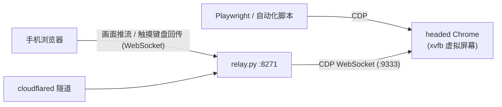

# browser-relay

在一台机器上跑一个**真正带界面的 Chrome**，手机浏览器就是它的屏幕和触摸板；同一个浏览器同时开放 CDP 端口给 Playwright 等自动化工具——**人和脚本共用同一个现场、同一份登录态**。

单文件 Python（约 450 行）+ 两个静态页面，唯一依赖是 `websockets`。没有 Docker、没有前端构建、没有数据库。

## 为什么要这个东西

- **自动化卡壳时人来接力**：脚本跑一半撞上验证码 / 扫码登录 / 风控弹窗，掏出手机点一下，脚本接着跑。反过来也一样——你手动登录一次，之后所有自动化都带着这份登录态。
- **登录态养在服务器上**：cookie 存在服务器的 Chrome profile 里，换手机、换电脑都不用重新登录。
- **手机上的"云浏览器"**：访问只有服务器可达的内网服务；或者单纯把重网页的 CPU/流量开销扔给服务器，手机只收 jpeg 流。

## 架构



工作原理一句话：relay 用 CDP 的 `Page.startScreencast` 把页面帧拿出来推给手机，手机的触摸/滚动/键盘事件转成 CDP 的 `Input.dispatch*` 打回去。手机端是一个纯静态页面，密码登录后即用，无需装任何 App。

支持：点按、滚动、软键盘输入、地址栏、前进后退刷新、**多标签页切换**、横竖屏自适应。

## 快速开始（本地）

```bash
pip3 install websockets
BROWSER_RELAY_PASS=你的密码 python3 relay.py
# 或用 ./start.sh 后台跑，./stop.sh 停
```

Mac 和 Linux 桌面环境直接可用（自动探测 Chrome / Chromium 路径，Mac 上会自动把 Chrome 窗口最小化）。默认只监听 `127.0.0.1:8271`；想让同一局域网的手机连，设 `BROWSER_RELAY_HOST=0.0.0.0`——但注意这是裸 HTTP，密码哈希会明文过网，**只能在可信局域网这么干**，公网必须走下面的隧道方案。

## VPS 部署（systemd + xvfb，2GB 小机实测）

```bash
# 1. 依赖：xvfb + Chrome（chromium 也行）
sudo apt install -y xvfb
# google-chrome-stable 按官方源装，或 apt install chromium-browser

# 2. 代码 + venv
sudo mkdir -p /opt/browser-relay && sudo chown $USER /opt/browser-relay
cd /opt/browser-relay && git clone <本仓库> . 
python3 -m venv venv && venv/bin/pip install -r requirements.txt

# 3. 配置（务必设强密码）
sudo cp .env.example /etc/browser-relay.env && sudo vim /etc/browser-relay.env

# 4. systemd
sudo cp deploy/browser-relay.service /etc/systemd/system/
sudo mkdir -p /etc/systemd/system/browser-relay.service.d
sudo cp deploy/resource-limits.conf /etc/systemd/system/browser-relay.service.d/
sudo systemctl daemon-reload && sudo systemctl enable --now browser-relay
```

### 公网访问：cloudflare tunnel

8271 端口永远只绑 `127.0.0.1`，TLS 和公网入口交给隧道：

```yaml
# cloudflared config.yml
tunnel: <tunnel-id>
credentials-file: /etc/cloudflared/<tunnel-id>.json
ingress:
  - hostname: browser.example.com
    service: http://127.0.0.1:8271
  - service: http_status:404
```

跑的时候建议 `cloudflared tunnel run --protocol http2`（实测比默认的 QUIC 在部分 VPS 网络上更稳）。手机访问 `https://browser.example.com`，输一次密码，30 天内免登录。

### 内存守护（可选，小内存机器强烈建议）

Chrome 在 2GB 的机器上是随时会把整台机器拖死的主。两层保险：

1. `deploy/resource-limits.conf`——systemd 层面给浏览器画红线（超限就停掉重启，牺牲浏览器保全机器）；
2. `deploy/browser-memory-guard.sh` + `.service`——盯着 MemAvailable/SwapFree，快见底时先杀最能吃的自动化进程、再重启浏览器服务。脚本里默认牺牲的是 playwright，换成你自己机器上的大户。

数值都是按 2GB 内存机器给的，**不可照抄**，按你的机器调。

## 和 Playwright 共享浏览器

```python
browser = playwright.chromium.connect_over_cdp("http://127.0.0.1:9333")
```

脚本和手机看到的是同一个浏览器：脚本开的标签页你手机上能切过去接管，你手动登录过的站点脚本直接是登录态。

## 安全模型（必读）

- **登录**：手机端把密码做 sha256 后发给服务器，服务器验证通过后下发另一个派生值作为 **HttpOnly** cookie（30 天）。页面里的 JS 读不到这个 cookie；恶意网页就算把标签页标题设成一段脚本，也只会被当纯文本渲染。改密码 = 所有已登录设备立刻失效。
- **三条铁律**：
  1. **CDP 端口（9333）绝不能出 `127.0.0.1`**。它没有任何鉴权，谁碰到它，谁就拥有这个浏览器里的一切——所有网站的登录态、所有 cookie。
  2. 8271 不要裸暴露公网，走 cloudflare tunnel 或自己的反代加 TLS。
  3. 密码必须强：登录没有防爆破，这道门就是全部。

## 踩坑史

按踩的顺序，每一条都付过学费：

1. **`/dev/shm` 太小，标签页秒崩**。Linux 上必须 `--disable-dev-shm-usage`（还有 `--no-sandbox`，无桌面环境跑不起 sandbox）。代码里对 Linux 自动加了。
2. **推流一分钟后卡成幻灯片**。xvfb 里的窗口在 Chrome 眼里永远"不可见"，会被后台节流三连（渲染降频、定时器降频、occluded 窗口不画）。三个 `--disable-background*` / `--disable-backgrounding-*` 开关全关掉才恢复。
3. **收几帧就没了**。`Page.screencastFrame` 每一帧都必须回 `screencastFrameAck`，不回的话 Chrome 认为你消化不动，直接停止推帧。
4. **切标签页 = 换一条 CDP 连接**。CDP 的页面级 WebSocket 是一个标签页一条，切标签是断开重连另一条；标签页被关掉连接就死，必须有自动重连兜底，不然手机上就是永久黑屏。
5. **iOS Safari 不允许凭空弹软键盘**。页面里藏一个 1px 的隐形 input，点按画面后 focus 它来接键盘输入，再把输入事件转成 CDP 打过去。
6. **xvfb-run 要加 `-a`**。自动挑空闲的 display 号，不然重启撞 display 直接起不来。
7. **Chrome 在 2GB 机器上会拖死整台机**。见上面的内存守护两层保险；`OOMPolicy=stop` + `Restart=always` 的组合意思是"宁可浏览器重启 30 秒，不能让 SSH 都连不上"。
8. **日志里 dbus / GCM 报错刷屏是正常的**。无桌面总线环境 Chrome 就是会一直抱怨 `Failed to connect to the bus`，不影响任何功能，不用修。

## 已知限制

- 单密码单用户，无防爆破（靠强密码 + 隧道）。
- 声音不传，只有画面。
- 不支持多指手势（捏合缩放）。
- 文件上传/下载对话框是系统级窗口，xvfb 里没法交互。

## License

MIT
