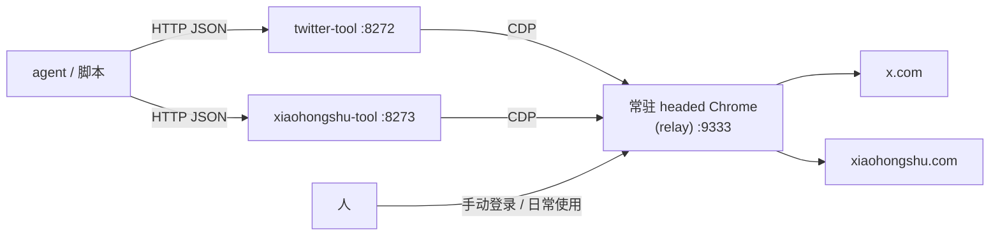

# actions —— 社交动作服务

> 本目录是仓库的动作层。想要"从零到 agent 刷起来"的完整部署流程，看[仓库根 README](../README.md)；这里是动作服务自身的完整文档，**动作参考章节就是喂给 agent 的工具说明**。

把"刷推特 / 刷小红书"包装成**一小把具体动作**的 HTTP 服务，给 AI agent（或任何脚本）调用。

不给 agent 一个完整浏览器，只给它 `feed / read / like / reply / post` 这样的动词。每个动作背后是 Playwright 通过 CDP 连一台**常驻的、人工登录好的 Chrome**，复用真实登录态干活，返回结构化 JSON。

两个独立服务，可以只部署其中一个：

| 服务 | 平台 | 动作 | 端口（示例） |
|---|---|---|---|
| `twitter-tool` | x.com | 读 3 个 + 写 5 个 | 8272 |
| `xiaohongshu-tool` | xiaohongshu.com | 只读 4 个 | 8273 |

那台常驻 Chrome 本体在同仓库的 [`relay/`](../relay/README.md)（服务器上跑 headed Chrome + 远程调试端口，人和工具共用一个浏览器）。本目录就是"接上 relay 之后，agent 能干什么"的答案。

## 为什么是"动作制"，而不是给 agent 整个浏览器

- **误操作面积小。** agent 只能做清单上的几件事，不存在"顺手点开奇怪的东西"。
- **返回结构化 JSON。** 推文列表直接进上下文，不用截图、不用 dump DOM，省 token 也省事。
- **写操作全部落审计日志。** 每次点赞/发帖连正文一起记进 `actions.log`，出了事有账可查。
- **频率闸在服务端。** 每小时发帖 ≤5、互动 ≤20，滑动窗口、跨重启持久化。agent 说破天也绕不过去。
- **不碰凭据。** 不导出 cookie、不存密码，登录这件事永远由人在浏览器里做。



## ⚠️ 安全须知（必读）

1. **服务没有鉴权。** 谁能访问这个端口，谁就能用你的账号发推。只绑 `127.0.0.1` 或内网地址，绝对不要暴露公网。要跨机器调用，套一层带鉴权的反代或走内网。
2. **自动化操作违反 X / 小红书的服务条款**，有封号风险，后果自负。强烈建议用专门账号，别拿主号试。
3. **频率闸的默认值故意很小**（每小时 5 条发帖、20 次互动）。这个项目是给"个人 agent 顺手刷刷推"设计的，不是营销/刷量工具。数值在 `app.py` 的 `RATE_LIMITS` 里，可以改，但请别把它改成刷量工具。
4. `actions.log` 是你的真实操作史（含发帖正文），`.gitignore` 已经挡了，自己也别到处拷。

## 快速开始

**前置条件：** 一台常驻 headed Chrome，开着 `--remote-debugging-port=9333`，并且已经在里面**人工登录**了 x.com / 小红书。推荐直接用同仓库的 [`relay/`](../relay/README.md)（部署见根 README）；裸起一个 Chrome 也行。

```bash
cd actions
python3 -m venv venv
venv/bin/pip install -r requirements.txt
# 不需要 playwright install：只连现成浏览器，不下载/启动自己的浏览器

cd twitter-tool
../venv/bin/uvicorn app:app --host 127.0.0.1 --port 8272
```

冒烟：

```bash
curl -s localhost:8272/health
# {"ok": true, "tabs": ..., "owned_pages": 0, ...}

curl -s localhost:8272/twitter -X POST -H 'content-type: application/json' \
  -d '{"action":"feed","n":5}'
```

小红书同理（`xiaohongshu-tool` 目录、端口随意、端点是 `POST /xiaohongshu`）。

长期跑用 systemd：`systemd/` 下有两份示例 unit，改掉 `YOUR_USER` 和路径即可。

## twitter-tool 动作参考

统一入口 `POST /twitter`，body 是 `{"action": "...", ...}`。

### 读动作

| action | 参数 | 说明 |
|---|---|---|
| `feed` | `query?` `n?`(≤30) `latest?` | 不带 `query` = 首页时间线；带 = 搜索；`latest: true` = 按最新排序 |
| `profile` | `user?` `n?`(≤30) | 某人最近推文；不带 `user` 时回退到 `TW_DEFAULT_USER` |
| `read` | `url` `n?`(≤40) | 单条推文 + 楼上线程 + 评论；此动作放行图片加载，能拿到图片直链 |

每条推文返回：`url / time / author / handle / text / stats(回复·转发·赞) / liked_by_me / images / has_video / quoted_text / promoted(广告标记) / truncated(长文被折叠)`。

**`read` 命中刚拿到的列表结果时不走 `goto` 硬跳。** 如果传入的 `url` 是最近一次 `feed`/`profile`（还没过期，见下面 `TW_BROWSE_TTL_SECONDS`）返回结果里的推文，会在那个仍然开着的列表页里用真实滚轮找到卡片、真实点击进详情，读完再模拟后退把列表页留住给下一次 `read` 接着用——这是根 README"改 Playwright 别走捷径"里说的那类真实事件。返回结果里的 `navigation` 字段标出走的哪条路：`feed_card_click`（命中列表，点进去的）/ `direct_url_fallback`（外部链接、不在最近列表里，或列表已过期，直接 `goto`）。命中列表但在渲染出的 DOM 里翻不到卡片时，**不会自动降级去硬跳 URL**，而是直接返回 `{"ok": false, "navigation": "card_click_failed", ...}`，避免"看似成功实则走了容易被识别的路径"。

### 写动作

| action | 参数 | 频率组 |
|---|---|---|
| `like` / `unlike` | `url` | engage（合计 20 次/小时） |
| `repost` | `url` | engage |
| `reply` | `url` `text` | publish（合计 5 次/小时） |
| `post` | `text` | publish |

**写动作返回三态**，这是整个项目最重要的设计：

| `outcome` | 含义 | 调用方该做什么 |
|---|---|---|
| `confirmed` | 已二次验证生效（按钮翻转 / 按 tweet id 回读到原文） | 正常继续 |
| `failed` | 确认没发生（参数错、按钮灰、接口 4xx） | 可以改参重试 |
| `uncertain` | **动作可能已经生效但没验证上** | **禁止自动重试**，人工去页面确认 |

为什么要有 `uncertain`：点了发送但网络监听没抓到响应 ≠ 失败。把"可能已发出"误报成失败，agent 一重试就是重复发帖。验证链分三层：先挂网络监听再点击（捕获 X 的 GraphQL 响应）→ 等按钮状态翻转（UI 确认）→ 发帖/回复类再拿响应里的 tweet id 做一次**纯读取回访**，正文逐字对上才算 `confirmed`。

**读/写动作还都可能返回第四种 `outcome`：`challenge`**——页面命中 X 的人机验证特征（arkose 验证 iframe，或跳到 `/i/flow/challenge` 之类的挑战 URL）时，不会当成普通失败硬试下去，而是立刻停手返回 `{"outcome": "challenge", "retry_safe": false, "hint": "...请用手机接管 browser-relay 完成验证后再试"}`。命中的写动作**不计入频率闸**（没消耗名额，重试语义和"没发生"一致）。这是"自动化卡壳时人来接力"在代码里的落点：agent 看到这个 outcome 就该停，掏出手机走一遍 [`relay/`](../relay/README.md) 里说的人工接管。

## xiaohongshu-tool 动作参考

统一入口 `POST /xiaohongshu`。**只读**：代码里只有导航、滚动、读 DOM，没有任何点击/输入/发布。为什么不做写：小红书风控比 X 激进得多，写操作的封号风险和收益完全不成比例；只读已经够 agent "看看小红书在聊什么"用了。

| action | 参数 | 说明 |
|---|---|---|
| `feed` | `n?`(≤30) | 发现页信息流 |
| `search` | `query`(≤100字) `n?` | 搜索笔记 |
| `read` | `url` `n?`(评论数≤40) | 笔记详情：标题/正文/图片(含 live photo 标记)/标签/互动数/我是否点过赞收藏/评论(含子评论、IP 属地) |
| `profile` | `url` 或 `user`(24位id) `n?` | 用户资料 + 最近笔记 |

和 twitter-tool 一样，`feed`/`search`/`profile` 返回的笔记如果紧接着被 `read`，会在同一个仍开着的列表页里真实点击封面进详情（不 `goto` 硬跳），读完模拟返回把列表页留住；命中时列表结果里会带 `read_navigation: "card_click_available"` 提示可以这么用，`read` 返回结果里的 `navigation` 字段标实际走的是 `feed_card_click` 还是 `direct_url_fallback`；渲染出的 DOM 里找不到对应封面时返回 `{"ok": false, "navigation": "card_click_failed", ...}`，不会自动降级硬跳。命中平台的验证挑战时（如滑块）同样会中断返回 `{"outcome": "challenge", ...}`，提示掏手机去 [`relay/`](../relay/README.md) 里人工过一遍。

**链接怎么传（重要）：** 小红书的笔记链接依赖 `xsec_token`——平台发的防爬签名，跟着链接走。给 `read` 传 URL 时，**直接用 `feed`/`search`/`profile` 返回结果里的 `url` 字段原样传**最稳；网页版复制的完整链接（带 token）也可用；App 分享出来的 `xhslink.com` 短链直接传即可，`read`/`profile` 会**自动展开**成主站链接再走原流程（展开时只向 xhslink 域名发请求、拿到主站链接就停，中途跳到白名单外的域名一律拒绝）。只拿笔记 ID 自己拼的裸链接没有 token，多半打不开（表现为"等待笔记详情超时：链接可能缺少有效 xsec_token"）。

安全阀：`read`/`profile` 只接受 `xiaohongshu.com` 主站 URL，不会被当成任意网页抓取器用。

## 配置

全部走环境变量，都有默认值：

| 变量 | 默认 | 说明 |
|---|---|---|
| `TW_CDP_URL` | `http://127.0.0.1:9333` | 常驻 Chrome 的 CDP 地址 |
| `TW_DEFAULT_USER` | 空 | `profile` 不带 `user` 时看谁的主页 |
| `TW_STATE_PATH` | `app.py` 同目录 | 频率窗口 + 自有标签页台账的落盘路径 |
| `TW_ORPHAN_MINUTES` | 30（最小 30） | 遗孤标签页回收阈值 |
| `TW_BROWSE_TTL_SECONDS` | 180（最小 30） | `feed`/`profile` 留给后续 `read` 点击复用的列表页存活时长 |
| `XHS_CDP_URL` | `http://127.0.0.1:9333` | 同上，小红书侧 |
| `XHS_BROWSE_TTL_SECONDS` | 180（最小 30） | 同上，小红书侧 |

频率闸数值在 `twitter-tool/app.py` 顶部的 `RATE_LIMITS`。

## 踩坑史

这套东西看着简单，下面每一条都是真踩过的坑。**如果你只想抄走一个思路，抄第 1 条和第 3 条。**

1. **新标签页的归属不能靠猜。** "创建页面后监听下一个新页事件"在共享浏览器里是错的——人（或另一个工具）恰好这时开了个页，你就把别人的标签页接管了。正确姿势：用 CDP `Target.createTarget` 显式拿 `targetId`，再逐页比对 target id 认领；对不上就宁可报错，绝不接管来路不明的页。创建过程整体加锁串行。
2. **僵尸标签页会拖死 CDP 连接。** 工具崩溃/超时会留下自己开的页，积累多了 `connect_over_cdp` 直接卡死。解法：自己开的 target 记台账并**落盘**（跨重启有效），连接失败先按台账清遗孤再重连；后台每 60 秒扫一次静默超 30 分钟的自有页。关键：只清台账里的，绝不按 URL 猜——人也会开 x.com。
3. **写操作结果必须三态**（见上文）。二态（成功/失败）+ agent 自动重试 = 迟早重复发帖。
4. **频率闸的判断和记账必须都在写锁内。** 放锁外的话，两个并发请求会同时穿过"最后一个名额"。
5. **资源拦截要分动作。** 默认掐掉 image/media/font 省内存带宽（图片链接从 DOM 属性抓，不用真下载）；但推文详情页必须放行图片——请求被掐时 `img` 元素根本不渲染，抓不到图链。小红书则全程保留图片请求，轮播组件依赖它初始化。
6. **广告识别的最稳信号是"没有时间戳"。** 推广卡片没有 `time` 元素/永久链接；`placementTracking` 是补充信号。
7. **笔记详情优先读渲染出来的 DOM，`window.__INITIAL_STATE__` 降级成兜底。** 早期反过来——直接从 Vue 的响应式内部状态里拿（子评论、IP 属地、live photo 确实全在里面，但要先 unwrap `_value`/`_rawValue`），问题是这是没公开的内部结构，页面一次不大的改版就可能连字段名带路径一起变。现在默认先解析真实渲染出的 DOM，只有关键字段或评论缺失时才去碰 `__INITIAL_STATE__` 补全，返回结果里 `extraction_source` 标了走的是 `dom` 还是 `dom+store_fallback`。另外笔记详情链接依赖 `xsec_token`：把 `feed`/`search` 返回的完整 URL 原样传给 `read` 最稳，按笔记 ID 自己拼的裸链接大概率打不开（见上文"链接怎么传"）。
8. **"登录"两个字不等于掉线。** 页面正文里出现"登录"字样很正常，只在内容确实加载不出来时才去查登录态，否则全是误报。
9. **关页失败不能污染动作结论。** 发帖成功但收尾关标签页超时，结果必须还是成功——清理失败单独记日志，异步收尾但保证容量信号量最终释放。
10. **命中列表就点真实卡片，别对已知链接也走 `goto`。** `read` 如果传的是刚从 `feed`/`search`/`profile` 拿到的链接，会在那个还开着的列表页上用真实滚轮/点击找到卡片进详情，读完再模拟后退把列表页留住——比每次都新开页 `goto` 更接近人的操作节奏（呼应根 README"改 Playwright 别走捷径"那条）。只在链接来自外部、不在最近列表里，或列表已经过期时才直接 `goto` 兜底；渲染 DOM 里找不到卡片时也不会静默降级去硬跳，而是明确报错，交给调用方决定要不要重试。
11. **风控挑战要识别出来单独处理，不能和"页面结构变了"混在一起报错。** 撞上滑块/人机验证特征时，如果只当成普通异常，agent 看到的是和"选择器失效"一样的报错，分不清是该等选择器修复还是该叫人来解个验证码。加了 `ChallengeDetected` 专门识别验证特征，统一转成 `outcome: "challenge"`（写动作还会跳过频率闸计数），让"该叫人接管了"这件事在返回结果里就是明确的。

## 失败路径速查

| 症状 | 原因 | 处理 |
|---|---|---|
| `/health` 报"连不上中继浏览器" | 常驻 Chrome 没起 / CDP 地址端口不对 | 起 relay，核对 `*_CDP_URL` |
| 返回"登录态失效" | 浏览器里掉登录了 | 去常驻 Chrome 里人工重新登录 |
| "等推文加载超时 / 页面结构已变化" | 网慢，或平台改版导致选择器失效 | 重试一次；还不行就得跟着改版更新选择器 |
| "频率闸：…已用满" | 撞限流窗口 | 等提示的分钟数，窗口是滑动的 |
| 写动作返回 `uncertain` | 点了但没验证上 | **人工去页面确认，不要重试** |
| 返回 `outcome: "challenge"` | 撞上平台的人机验证/风控挑战页 | 掏手机走 [`relay/`](../relay/README.md) 人工过一遍验证，写动作没消耗频率闸名额 |
| `read` 返回 `navigation: "card_click_failed"` | 命中最近列表，但渲染出的 DOM 里没找到对应卡片 | 页面可能还在变化，重试一次；持续失败就当列表已过期，直接传外部链接走兜底 |

## 边界与不做的事

- 选择器绑的是 2026-07 的页面结构。X 和小红书随时可能改版，改版后读动作会以"等待超时"的形式明确失败，不会静默返回错数据。
- 不做多账号、不做代理池、不做验证码破解——这些是刷量工具的需求，不是本项目的。
- 小红书侧没有写操作，也不打算加。
